<div align="center">
  
</div>

<br>

## ⚡ About me

I build products end to end: the web app, the API behind it, and the mobile app in your pocket. My focus right now is **commerce at scale** (catalogs, checkout, CMS-driven storefronts) and **real-time** features, running on infrastructure I own.

```ts
const monaf = {
  title: "Computer Engineer",
  focus: ["full-stack web", "mobile", "real-time"],
  building: "storefront — one commerce platform: web, API, and app",
  stack: {
    web: ["Next.js", "React", "Tailwind CSS", "shadcn/ui", "next-intl"],
    api: ["Hono", "Better Auth", "Drizzle ORM", "PostgreSQL", "Redis", "BullMQ"],
    mobile: ["Expo", "React Native"],
    infra: ["Docker", "Dokploy", "Traefik", "Cloudflare", "Turborepo + pnpm"],
  },
  learning: "Go — for the hot paths",
  principles: [
    "stability over novelty",
    "official docs over memory",
    "minimal, typed, shipped",
  ],
} as const;
```

## 🚀 What I'm building

<table>
<tr>
<td width="50%" valign="top">

### 🛒 storefront

A multi-platform e-commerce system in one **Turborepo**: a Next.js storefront and admin dashboard, a Hono API, and an Expo app. All three share a typed Drizzle schema, Zod contracts, and i18n packages.

- 🌍 English · Turkish · Arabic, with **first-class RTL** on web and mobile
- 🧱 Block-based page builder on **Payload CMS**: sliders and grids configurable per breakpoint
- ⚙️ **Redis + BullMQ** for shared state and background jobs
- 🐳 Dockerized and deployed on **Dokploy + Traefik**, behind **Cloudflare**

</td>
<td width="50%" valign="top">

### 📹 1-on-1 video calling

Real-time video calls on a fully self-hosted stack, with no managed platform in the middle.

- 🔗 **WebRTC** peers with **Socket.IO** signaling
- 🛰️ Self-hosted **Coturn** TURN over TLS, with short-lived HMAC credentials
- 🖥️ Web client built as a `useVideoCall` hook with a picture-in-picture UI
- 📱 Mobile client alongside it

</td>
</tr>
</table>

## 🧠 Engineering highlights

- **Streaming bulk import.** Excel files stream as NDJSON into a live table with real-time stats, filters, abort, and an error-CSV export. Images download in parallel, and blank cells never overwrite existing data.
- **Rendering architecture.** Next.js Partial Prerendering serves static shells instantly and defers dynamic data behind Suspense boundaries.
- **Auth that holds up.** Google and Apple sign-in (native and web), email OTP, refresh-token rotation, and AES-256-GCM encryption for PII fields.
- **Filterable catalogs.** Attribute filters combine as AND across attributes and OR within one, with IntersectionObserver paging and race-safe request guards.

## 🛠️ Tech stack

<p align="center">
  <a href="https://skillicons.dev"></a>
  <br>
  <a href="https://skillicons.dev"></a>
</p>

<p align="center">
  
  
  
  
  
  
  
  
  
  
  
  
  
  
</p>

## 📊 GitHub at a glance

<p align="center">
  <picture>
    <source media="(prefers-color-scheme: dark)" srcset="./profile/stats-dark.svg">
    <source media="(prefers-color-scheme: light)" srcset="./profile/stats-light.svg">
    
  </picture>
  <picture>
    <source media="(prefers-color-scheme: dark)" srcset="./profile/langs-dark.svg">
    <source media="(prefers-color-scheme: light)" srcset="./profile/langs-light.svg">
    
  </picture>
</p>

## 🔭 Right now

- 🏗️ Shipping **storefront** across web, API, and mobile
- 🌱 Learning **Go** for high-throughput pieces: image processing, WebSockets, and event pipelines
- 💬 Ask me about Next.js rendering, monorepos, or self-hosting real-time infrastructure

<br>

<p align="center">
  <picture>
    <source media="(prefers-color-scheme: dark)" srcset="./profile/snake-dark.svg">
    <source media="(prefers-color-scheme: light)" srcset="./profile/snake-light.svg">
    
  </picture>
</p>

## 🤝 Let's connect

<p align="center">
  <a href="https://monafhorany.com/"></a>
  <a href="https://www.linkedin.com/in/monaf-horany-40a8471aa/"></a>
  <a href="https://www.instagram.com/monaf_horany/"></a>
  <a href="https://www.facebook.com/abo.almagd.716/"></a>
</p>

<p align="center"><sub>Thanks for stopping by ✨ · cards refresh daily via GitHub Actions</sub></p>
